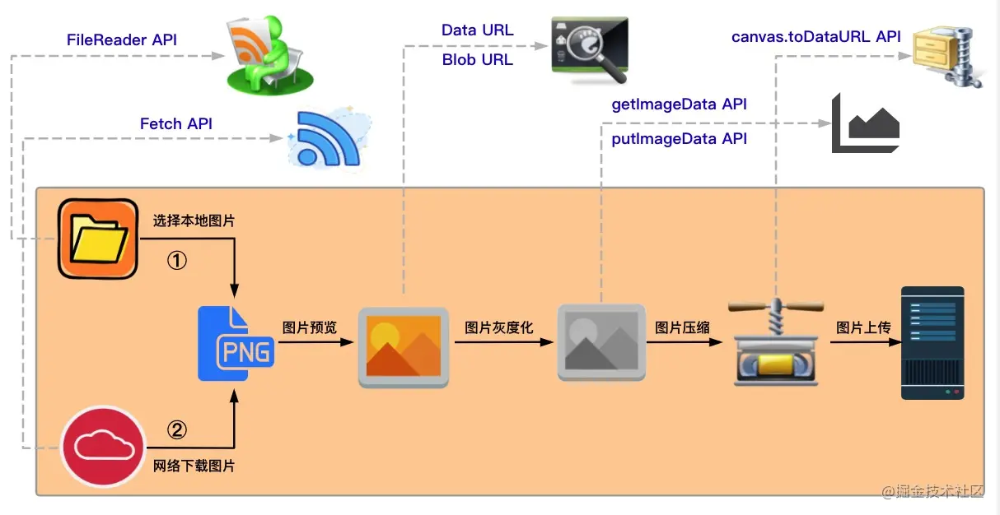
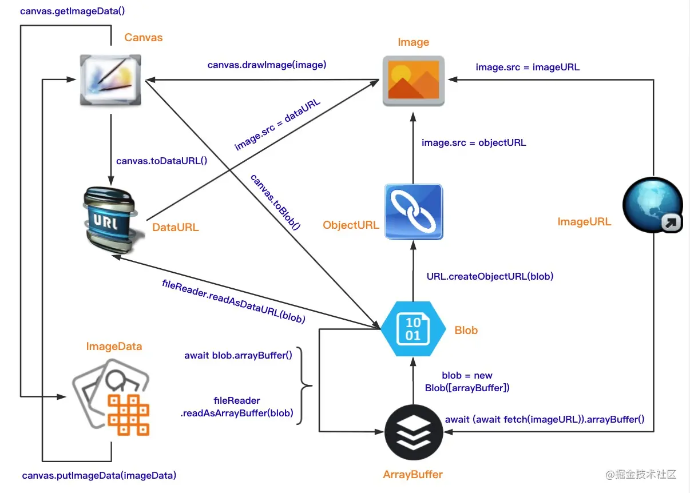

### 前端二进制关键词
Blob、Blob URL、Base64、Data URL、ArrayBuffer、TypedArray、DataView

### 图片处理

### 数据转换

### FileReader API
- File extends Blob

### Data URL
- `data:image/png;base64,iVBORw0KGgoAAAANSUhEUgAAAhAAAAIwCAYAAADXrFK...`
- `data:[<mediatype>][;base64],<data>`
- [Data URL](https://developer.mozilla.org/zh-CN/docs/Web/HTTP/Basics_of_HTTP/Data_URIs)
- [Base64](https://developer.mozilla.org/zh-CN/docs/Glossary/Base64)

### ObjectURL

- `blob:<origin>/<uuid>`

- [ObjectURL](https://developer.mozilla.org/zh-CN/docs/Web/API/URL/createObjectURL)
