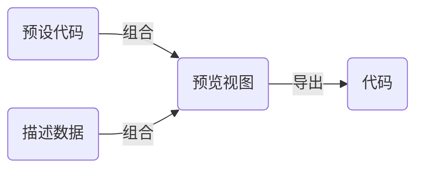
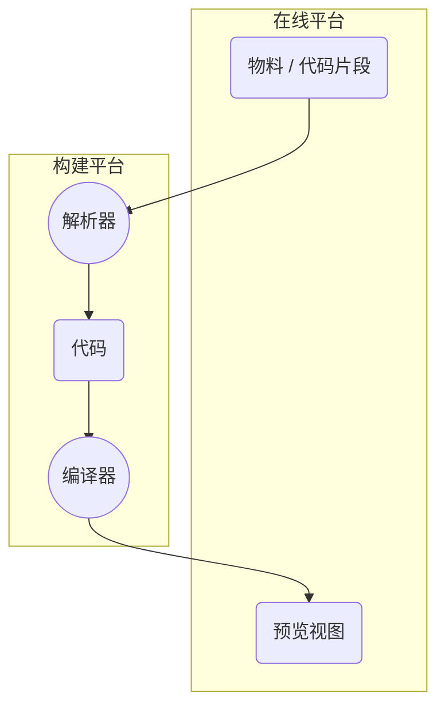

## 1. DSL => View

```mermaid
graph LR
A(预设代码)
B(描述数据)
C(预览视图)
D(代码)
A & B --组合--> C --导出--> D
```

## 2. code => complain => view

```mermaid
flowchart TB
subgraph 构建平台
A(代码)
1((编译器)):::processor
2((解析器)):::processor
A --> 1
2 --> A
end
subgraph 在线平台
B(预览视图)
C(物料 / 代码片段)
C --> 2
end
1 --> B
classDef processor r:36px;
```

