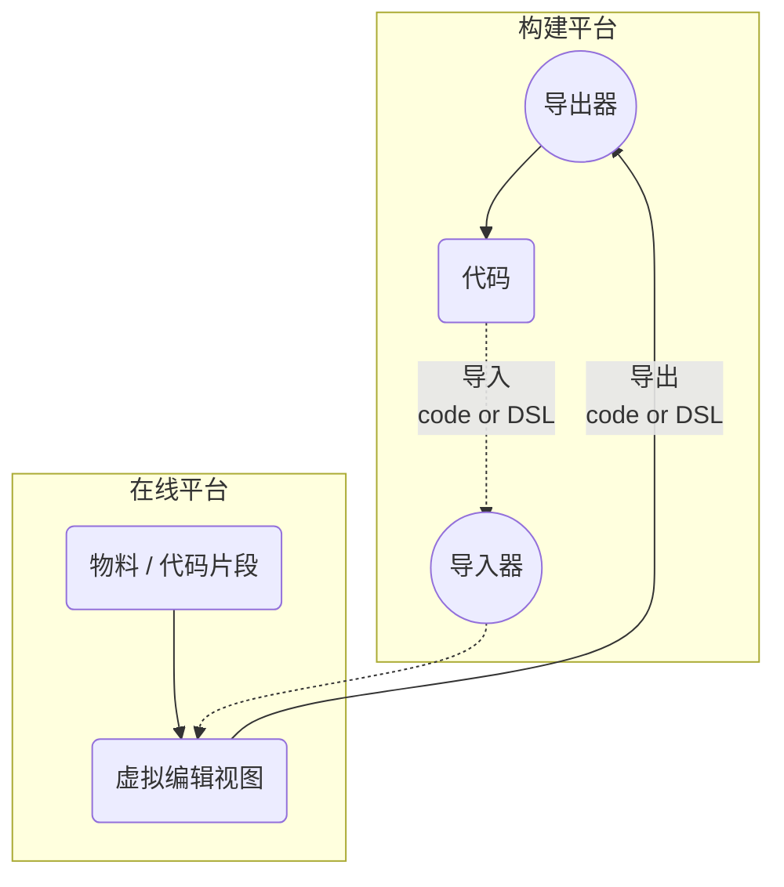
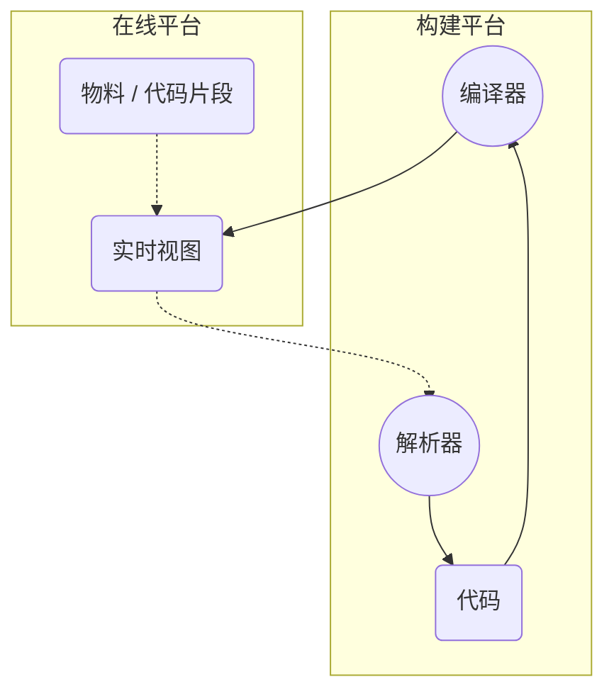

## 1. 虚拟实时编辑

### 优点
1. 简单性：在DSL、虚拟实时的限制条件下，实现不算复杂
   > [DSL demo](./images/dooring-DSL.ts)
2. 敏捷性：导出、导入2个流程，可拆分为2个阶段分步实现
### 缺点
1. 真实性：虚拟视图使得无法实时看到真实的结果
2. 灵活性：可视化编辑与代码编辑不能同时存在

## 2. 实时编辑

### 优点
1. 真实性：所见即所得
2. 灵活性：可视化编辑的同时可代码编辑
### 缺点
1. 复杂度：真个闭环流程较为复杂
2. 执行速度：解析、编译的速度有待验证

