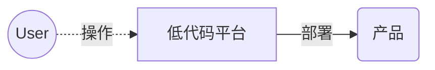
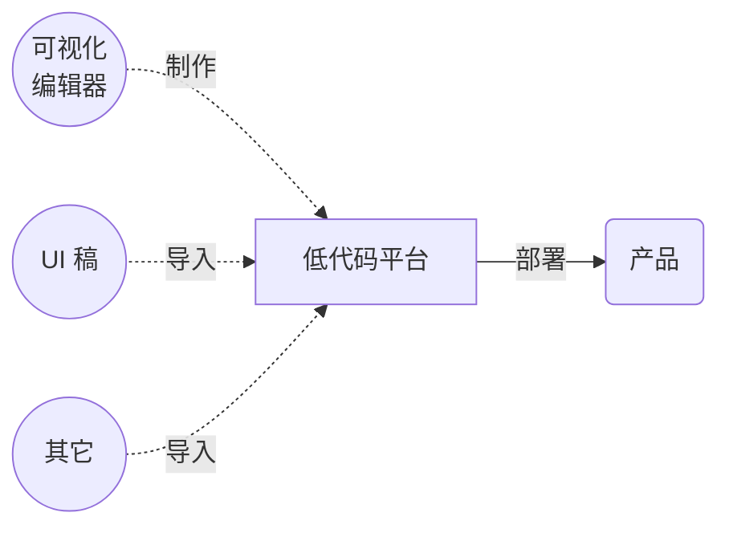
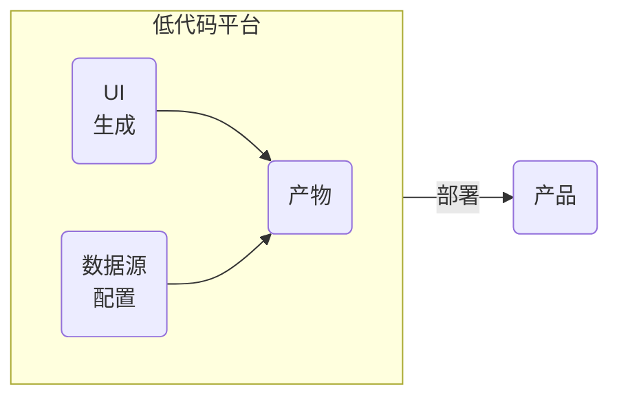

- 关键设计原则：
  1. SRP：划分边界，分开不同变更速率和原因的组件，例如核心逻辑和非核心逻辑隔离
  2. OCP：提供能力扩展，例如数据源获取方式、可视化编辑器的变更

- 设计要点
  1. 水平分层：变更
  2. 垂直切片：用例

- 动作
  1. 划分组件
  2. 编排组件
  3. 关联组件

### 整体

```mermaid
flowchart LR
A((User))
B[低代码平台]
C(产品)
A -.操作.-> B --部署--> C
```

### 导入源

```mermaid
flowchart LR
A1((可视化\n编辑器)):::processor
A2((UI 稿)):::processor
A3((其它)):::processor
B[低代码平台]
C(产品)
A1 -.制作.-> B
A2 -.导入.-> B
A3 -.导入.-> B
B --部署--> C
classDef processor r:36px;
```

### 低代码平台

```mermaid
flowchart LR
subgraph B[低代码平台]
    direction LR
    a(UI\n生成)
    b(数据源\n配置)
    c(产物)
    a --> c
    b --> c
end
C(产品)
B --部署--> C
```