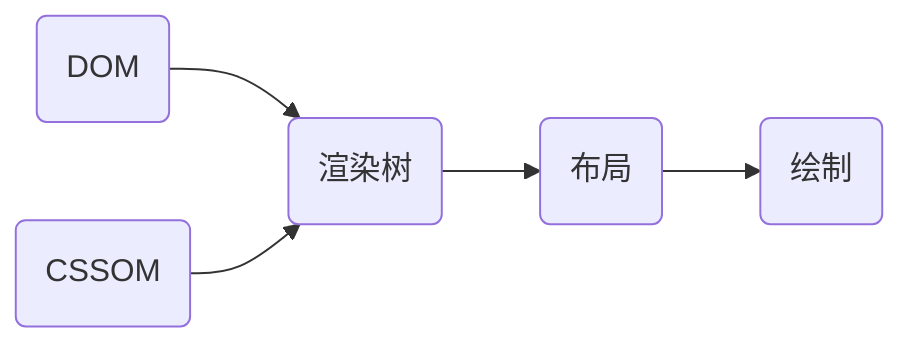
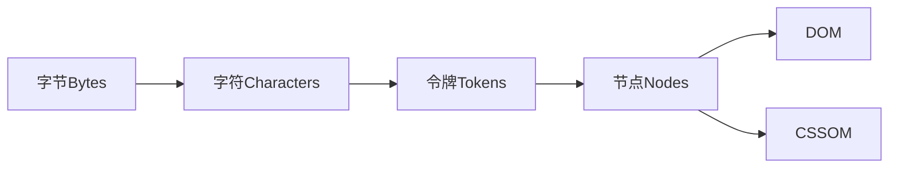
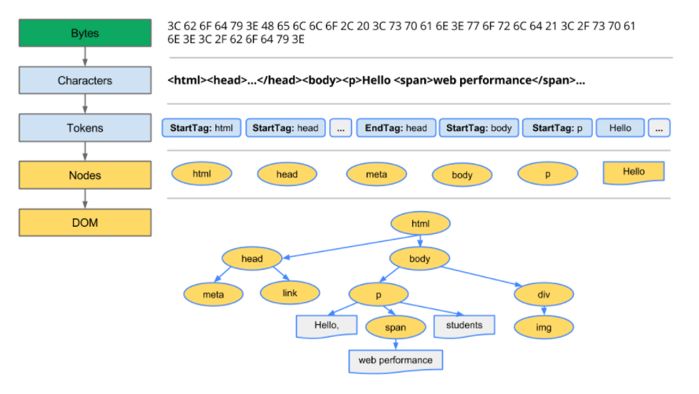
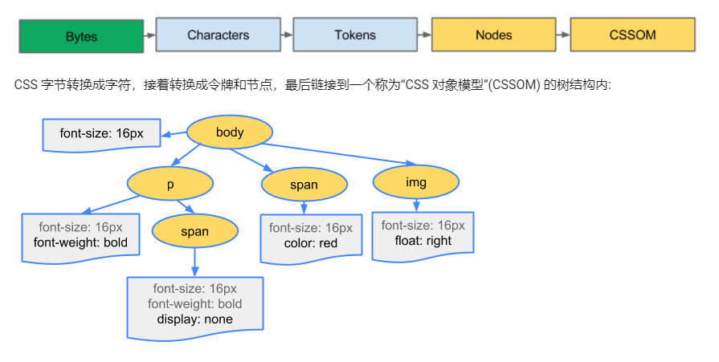
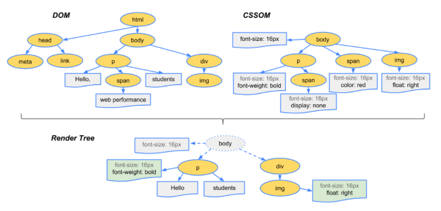

# 关键渲染路径CRP(Critical Rendering Path)

## 整体路径

## DOM和CSSOM
- HTML 标记转换成文档对象模型 (DOM)；CSS 标记转换成 CSS 对象模型 (CSSOM)。
- DOM 和 CSSOM 是独立的数据结构。
- DOM 构造是增量的，CSSOM 是渲染阻塞的
- DOM 树与 CSSOM 树合并后形成渲染树。

#### CSSOM
- 浏览器会阻塞页面渲染直到它接收和执行了所有的 CSS。因为规则可以被覆盖，所以内容不能被渲染直到 CSSOM 的完成
- .foo {} 是比 .bar .foo {} 更快，因为 .foo ，接下来必须沿着 DOM 向上走来检查 .foo 是不是有一个祖先 .bar。越是具体的标签浏览器就需要更多的工作，但这样的弊端未必值得优化。因为选择器的优化提升仅仅是毫秒级的。有其他一些方式来优化 CSS，例如压缩和使用媒体查询来异步处理 CSS 为非阻塞的请求。

#### DOM

#### CSSOM

## 渲染树
- 渲染树只包含渲染网页所需的节点。

## 相关资料
- [MDN关键渲染路径](https://developer.mozilla.org/zh-CN/docs/Web/Performance/Critical_rendering_path)
- [google关键渲染路径](https://developers.google.cn/web/fundamentals/performance/critical-rendering-path)