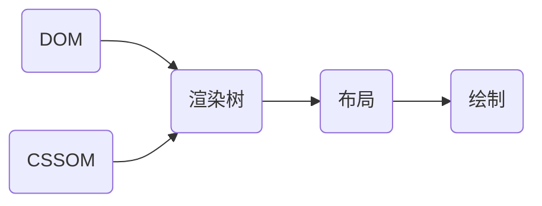
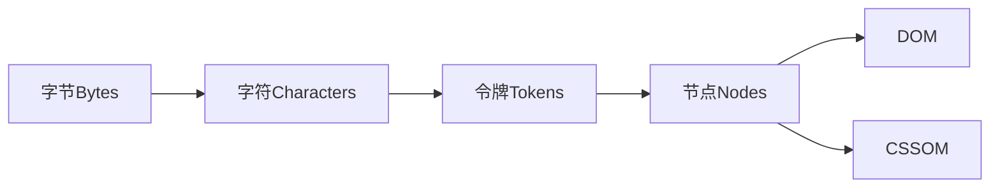

# 关键渲染路径CRP(Critical Rendering Path)

## 概述

#### 影响Web性能的两大主要原因
- 资源加载
- 单线程执行


## DOM和CSSOM
- HTML 标记转换成文档对象模型 (DOM)；CSS 标记转换成 CSS 对象模型 (CSSOM)。
- DOM 和 CSSOM 是独立的数据结构。
- DOM 构造是增量的，CSSOM 不是，因为存在样式覆盖。
- DOM 树与 CSSOM 树合并后形成渲染树。



#### DOM
- 当解析器发现非阻塞资源，例如一张图片，浏览器会请求这些资源并且继续解析。当遇到一个CSS文件时，解析也可以继续进行，但是对于`<script>`标签（特别是没有 async 或者 defer 属性）会阻塞渲染并停止HTML的解析。尽管浏览器的预加载扫描器加速了这个过程，但过多的脚本仍然是一个重要的瓶颈。


#### CSSOM
- 默认情况下，CSS 被视为阻塞渲染的资源。因为规则可以被覆盖，所以内容不能被渲染直到 CSSOM 的完成，可以通过媒体类型和媒体查询将一些 CSS 资源标记为不阻塞渲染。
- 浏览器会下载所有 CSS 资源，无论阻塞还是不阻塞。
- .foo {} 是比 .bar .foo {} 更快，因为 .foo ，接下来必须沿着 DOM 向上走来检查 .foo 是不是有一个祖先 .bar。越是具体的标签浏览器就需要更多的工作，但这样的弊端未必值得优化。因为选择器的优化提升仅仅是毫秒级的。有其他一些方式来优化 CSS，例如压缩和使用媒体查询来异步处理 CSS 为非阻塞的请求。

```html
<!-- 1和2一样阻塞，3在特定设备方向阻塞，4不阻塞 -->
<link href="style.css"    rel="stylesheet">
<link href="style.css"    rel="stylesheet" media="all">
<link href="portrait.css" rel="stylesheet" media="orientation:portrait">
<link href="print.css"    rel="stylesheet" media="print">
```


## 渲染树
- 渲染树只包含渲染网页所需的节点。
  - 不可见节点（如head）
  - 隐藏节点（display none）


## 布局
- 所有相对测量值都转换为屏幕上的绝对像素。
- 第一次确定节点的大小和位置称为布局。随后对节点大小和位置的重新计算称为回流。
  > 假设初始布局发生在返回图像之前。由于没有声明图像的大小，因此一旦知道图像大小，就会有回流。

## 绘制
- 栅格化：将指令转化为像素的过程
- 为了确保平滑滚动和动画，占据主线程的所有内容，包括计算样式，以及回流和绘制，必须让浏览器在16.67毫秒内完成。为了确保重绘的速度比初始绘制的速度更快，屏幕上的绘图通常被分解成数层。如果发生这种情况，则需要进行合成。
- 绘制可以将布局树中的元素分解为多个层。将内容提升到GPU上的层可以提高绘制和重新绘制性能（但是它以内存管理为代价）。有一些特定的属性和元素可以实例化一个层：
  - `<video>`和`<canvas>`
  - CSS属性为opacity、3D转换、will-change的元素，还有一些其他元素。这些节点将与子节点一起绘制到它们自己的层上，除非子节点由于上述一个（或多个）原因需要自己的层。
- Compositing，当文档的各个部分以不同的层绘制，相互重叠时，必须进行合成，以确保它们以正确的顺序绘制到屏幕上，并正确显示内容。

## 评估CRP

- domLoading: 这是整个过程的起始时间戳，浏览器即将开始解析第一批收到的 HTML 文档字节。
- domInteractive: 表示浏览器完成对所有 HTML 的解析并且 DOM 构建完成的时间点。
- domContentLoaded: 表示 DOM 准备就绪并且没有样式表阻止 JavaScript 执行的时间点，这意味着现在我们可以构建渲染树了。
  - 许多 JavaScript 框架都会等待此事件发生后，才开始执行它们自己的逻辑。
- domComplete: 顾名思义，所有处理完成，并且网页上的所有资源（图像等）都已下载完毕，也就是说，加载转环已停止旋转。
- loadEvent: 作为每个网页加载的最后一步，浏览器会触发 onload 事件，以便触发额外的应用逻辑。
> 详见[measure-crp](https://developers.google.cn/web/fundamentals/performance/critical-rendering-path/measure-crp)


## 相关资料
- [MDN关键渲染路径](https://developer.mozilla.org/zh-CN/docs/Web/Performance/Critical_rendering_path)
- [google关键渲染路径](https://developers.google.cn/web/fundamentals/performance/critical-rendering-path)