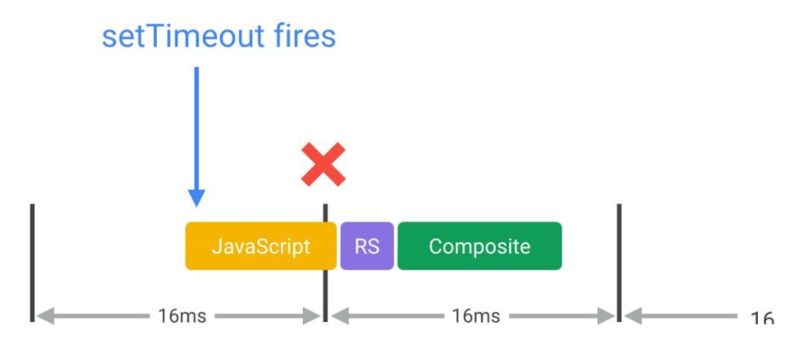
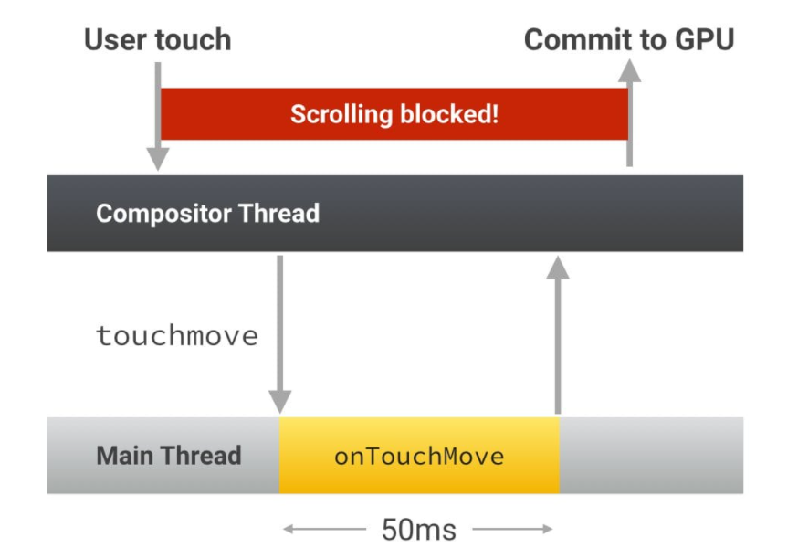
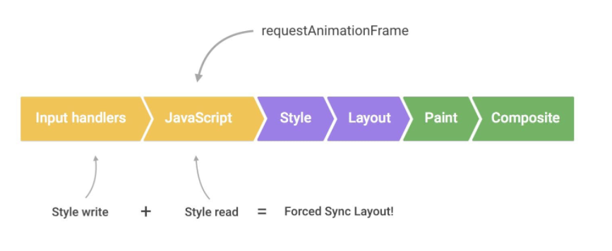

## 像素管道
### 1. JS / CSS > 样式 > 布局 > 绘制 > 合成

如果修改元素的“layout”几何属性（例如宽度、高度、左侧或顶部位置等），那么浏览器将必须检查所有其他元素，然后“自动重排”页面。任何受影响的部分都需要重新绘制，而且最终绘制的元素需进行合成。

### 2. JS / CSS > 样式 > 绘制 > 合成

如果修改“paint only”属性（例如背景图片、文字颜色或阴影等），即不会影响页面布局的属性，则浏览器会跳过布局，但仍将执行绘制。

### 3. JS / CSS > 样式 > 合成

如果修改一个既不要布局也不要绘制的属性，则浏览器将跳到只执行合成。这个版本开销最小，最适合于应用生命周期中的高压力点，例如动画或滚动。


## 优化渲染

### 优化JS执行
1. 对于动画效果的实现，避免使用 setTimeout 或 setInterval，请使用 requestAnimationFrame。
2. 将长时间运行的 JavaScript 从主线程移到 Web Worker。
3. 使用微任务来执行对多个帧的 DOM 更改。

#### 1.
- 如果希望在适合浏览器的时间执行，也就是正好在帧的开头。保证 JavaScript 在帧开始时运行的唯一方式是使用 requestAnimationFrame。
- 使用 setTimeout 或 setInterval 来执行动画之类的视觉变化，但这种做法的问题是，回调将在帧中的某个时点运行，可能刚好在末尾，而这可能经常会使我们丢失帧，导致卡顿。



### 避免大型、复杂的布局和布局抖动
- 使用 JavaScript 强制浏览器提前执行布局。这被称为强制同步布局。

### 简化绘制的复杂度、减小绘制区域

### 坚持仅合成器的属性和管理层计数
-目前只有两个属性符合仅合成器条件: transforms 和 opacity
- 在合理范围内提升到其自己的层
  > 滥用层提升将使 CPU 与 GPU 之间的带宽、GPU 上可用于纹理处理的内存都受到进一步限制。
  ```css
    .moving-element {
        will-change: transform;
        /* 对于旧版浏览器，或者不支持 will-change 的浏览器 */
        transform: translateZ(0);
    }
  ```

### 避免长时间运行输入处理程序


### 避免在输入处理程序中更改样式


## 相关资料
- [google rendering performance](https://developers.google.cn/web/fundamentals/performance/rendering)