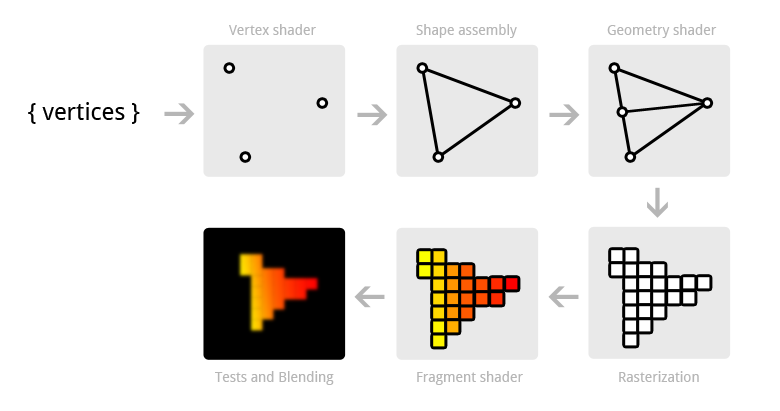

### The Graphics Pipeline
1. 顶点着色（Vertex shader）
2. 图元组装（Shape assembly）
3. 几何着色器（Geometry shader）
4. 栅格化（Rasterization）
5. 片元着色（Fragment shader）
6. 测试与混合（Test and Blending）

[图形图像渲染原理](http://chuquan.me/2018/08/26/graphics-rending-principle-gpu/)
[图解GPU](https://zhuanlan.zhihu.com/p/481294223)